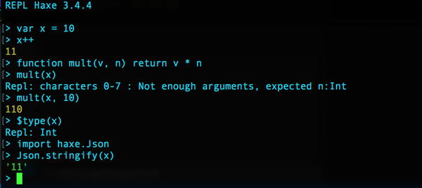

# Haxe REPL

> A Read-Eval-Print-Loop (REPL) is a simple, interactive computer programming environment
> that takes single user inputs (i.e. single expressions), evaluates them, and returns
> the result to the user; a program written in a REPL environment is executed piecewise.

This REPL runs on top of NodeJS's native REPL support, compiling Haxe code against
the JavaScript target, and incrementally executing it.

## Installation

Install globally:

    npm install haxe-repl -g
    haxe-repl

Or run without installation using `npx`:

    npx haxe-repl

## Usage

    # defaults with current folder as classpath
    haxe-repl

    # add extra compiler arguments directly
    haxe-repl -cp src -D my_define

The Haxe version will be printed, and you will be presented with a prompt
where you can enter and execute Haxe code line by line.

## Limitations

Only "body code" is allowed, which means:
- you can define variables and functions,
- you can NOT define types (e.g. `class`, `enum`...).

However you can `import` and `using` types, and evalute types using `$type(v)`.
